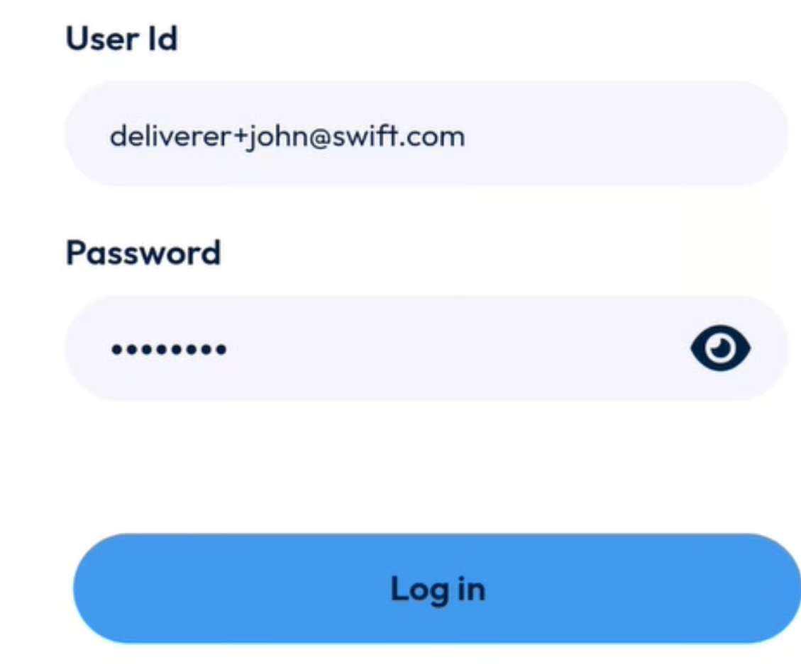

# AppLaunch-Login

Welcome to the Nomadia TourSolver mobile app! This guide will help you easily get started and log in, ensuring a smooth experience from the very beginning. We'll walk you through downloading the app, understanding the login screen, and successfully accessing your account.

### Getting Started

To ensure the best experience with the Nomadia TourSolver application, please check the system requirements for your device.

* **System Requirements** The Nomadia TourSolver application is designed to run on various mobile devices. To ensure the best experience, please check if your device meets the following requirements:
  * **Android** devices must be running **version 8 to 14**.
  * **iOS** (Apple) devices need to be running **version 15.5 or later**.
* **Installation & Setup Steps** Getting the Nomadia TourSolver app on your device is quick and easy!
  1. **Download the App**: You can download the Nomadia TourSolver application from either the **iOS App Store** (for Apple devices) or the **Google Play Store** (for Android devices).
  2. **Launch the App**: After downloading, find the **TourSolver icon** on your device's main screen and **tap it** to open the app.

*   **Initial Configuration: Login Screen Overview:** When you first launch the app, you'll always see the **login screen**. This screen is where you'll enter your information to access the app. It includes several key elements:

    * **User ID Field**: This is where you will type your unique user identification.
    * **Password Field**: This is where you will enter your secret password.
    * **Blue Login Button**: Located in the center of the screen, you'll tap this button after entering your details.

    <figure><figcaption></figcaption></figure>

    * **App Version Number**: You'll find this displayed in the bottom right corner of the screen.

### Feature Explanations with Benefits

*   **Password Visibility Toggle (Eye Icon)** The **password field** features a convenient **eye icon**. This feature allows you to **toggle the visibility of your typed password**. This means you can temporarily see the characters you're typing to ensure you haven't made any mistakes, then hide them again for security.

    * 💡 **Tip**: Use the eye icon to double-check your password before tapping **Login**, especially if you're having trouble logging in!

    <figure><figcaption></figcaption></figure>

### Common Tasks with Detailed Steps

*   **Logging In to the App** Your **user ID and password** are set by your **TourSolver back office administrator**. If you ever need to **change your password**, please **contact your administrator** directly. Here's how to log in:

    1. **Enter Your Information**: Tap into the **User ID field** and type your user ID. Then, tap into the **Password field** and type your password.

    <figure><figcaption></figcaption></figure>

2. **Tap Login**: Once both fields are filled, **tap the blue Login button**.

3. **Successful Login**: If your user ID and password are correct, you will be **successfully authenticated and logged into the app**.

* **Troubleshooting: Incorrect Login** Sometimes, you might make a typo or forget your password. Don't worry, the app will let you know!
  * If the **username or password you entered is incorrect**, an error message stating "**Incorrect username or password**" will appear. This message will be displayed between the password field and the login button.
  * ⚠️ **Warning**: If you see this message, double-check your user ID and password for typos, and ensure your Caps Lock is not accidentally on.

.png>)

### Productivity Tips

* 💡 **Password Management**: Always remember that your **TourSolver back office administrator** is the primary contact for any password changes or issues. Don't hesitate to reach out to them if you're having persistent login problems.
* 💡 **Quick Check**: Use the **eye icon** next to the password field to quickly verify your password entry before tapping **Login**. This can save you time if you tend to make typos.
