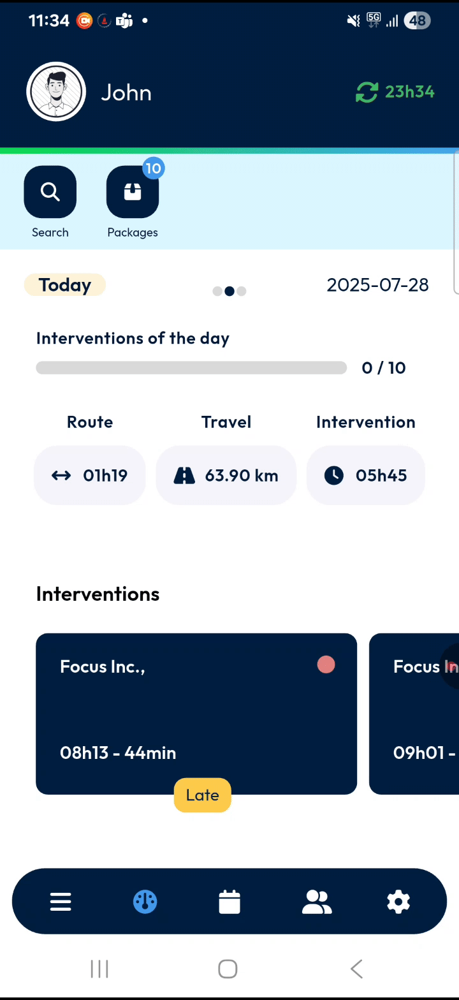
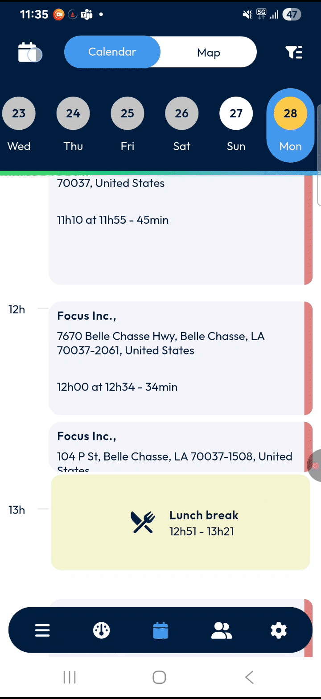
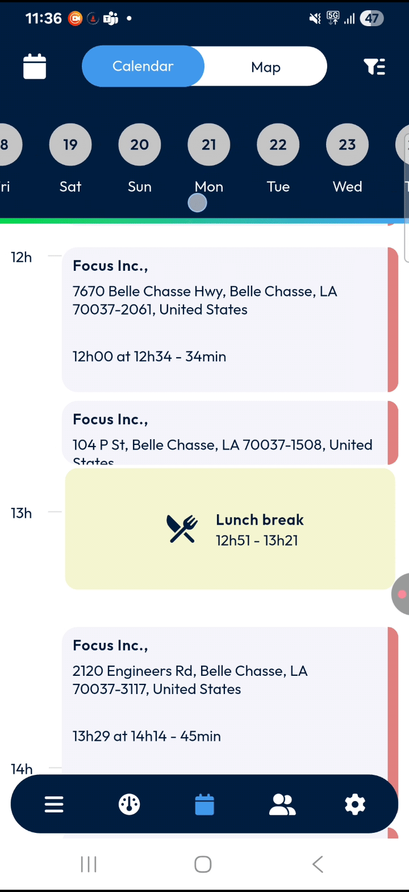
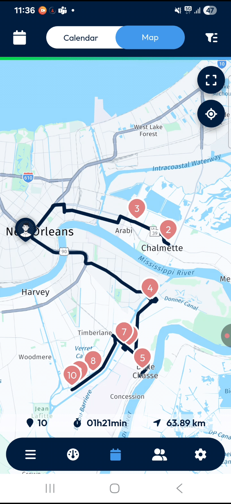
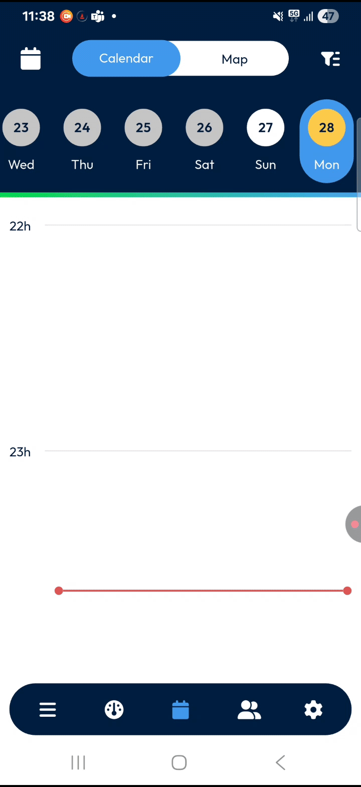
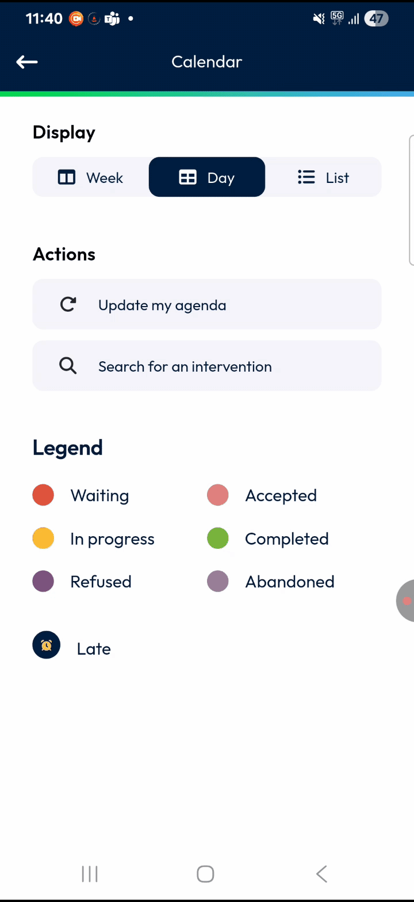
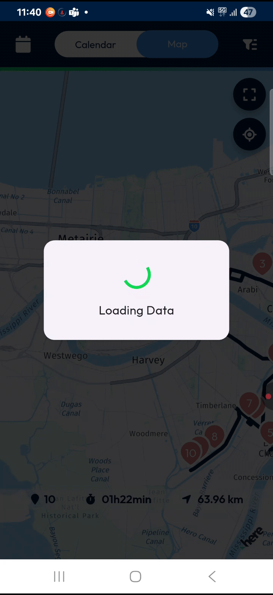

# MainActions-Calendar

Hello! This guide is designed to help you confidently navigate and master the **TourSolver Mobile/Calendar** feature, ensuring you can efficiently manage your daily interventions and stay organized. 

***

### 1. Introduction

Welcome to the **TourSolver Mobile/Calendar** user guide! This tool is your essential companion for managing your daily tasks and interventions, whether they are for today or in the future. The calendar screen helps you quickly view and organize your schedule, allowing you to easily switch between different views, apply filters, and use powerful search and update tools to keep everything running smoothly. Our goal is to make managing your interventions simple, clear, and frustration-free!

***

### 2. Getting Started

This section will guide you through the initial steps of accessing and understanding the TourSolver Mobile Calendar.

*   **Initial Configuration: Opening the Calendar Screen**
    The calendar screen is your starting point for managing interventions.

    1.  Start from the **main dashboard** of the app.
    2.  At the bottom of the app, you will find the main action buttons.
    3.  **Tap** the **calendar button** to open the calendar screen.

***

### 3. Feature Explanations with Benefits

The TourSolver Mobile Calendar offers several key features to help you manage your interventions effectively:

*   **Calendar View**: This view lists all your interventions as easily readable cards.
    *   **Benefit**: Provides a quick, at-a-glance overview of your schedule for the selected date, detailing customer names, addresses, and intervention times and durations.
*   **Map View**: This view graphically displays your route and the locations of your interventions on a map.
    *   **Benefit**: Offers a visual overview of your entire day's journey, including a route summary with the number of interventions, total duration, and distance to travel. It helps you visualize your route and intervention sequence.
*   **Date Selection**: This feature allows you to choose and view interventions for any specific date, whether it's today, a future date, or even a past date if viewing past data is enabled.
    *   **Benefit**: Gives you flexibility to plan ahead or review past activities, ensuring you are always looking at the correct schedule.
*   **Filters and Display Options**: Located at the top right, the filter button allows you to change how your calendar is displayed (e.g., day view, week view, or list view). It also provides access to the color legend and other useful actions.
    *   **Benefit**: Enables you to customize your view to best suit your needs, making it easier to focus on specific timeframes or types of information.
*   **Intervention Cards**: In Calendar view, each planned activity, whether it's an intervention or an event like a lunch break, appears as a card.
    *   **Benefit**: Each card summarizes essential information like customer name, address, and scheduled times. A small colored circle on the card provides a quick visual cue about the intervention's current status. Tapping a card provides more details and allows you to start a task.
*   **Route Summary (Map View)**: When in map view, you'll see a summary that includes the number of interventions, total duration, and total distance to travel.
    *   **Benefit**: Helps you quickly understand the scope of your day's work and travel requirements, aiding in time management and route planning.

***

### 4. Common Tasks with Detailed Steps

Here’s how to perform common tasks within the TourSolver Mobile Calendar:

#### How to Select a Different Date

You can easily select a different day to view its planned interventions.

1.  At the top left of the calendar screen, **tap** the **calendar icon**.

2.  You have several options to pick another date:
    *   To directly type a specific date, **tap** the **pencil icon**. Then, type your desired date.
    *   To move to the **next month**, **tap** the **right arrow symbol**.
        *   ⚠️ *Warning*: The left arrow symbol, which moves to the previous month, is usually disabled because past data isn't viewable.
    *   To jump to a different year, **tap** the **down arrow** next to the displayed date, month, and year.
    *   Alternatively, you can simply **pick any date** directly on the calendar grid displayed in the pop-up.
        *   💡 *Tip*: Yellow circles indicate your selected date, white circles show days of the current week, and gray circles show days in the previous week.
3.  Once you have chosen your desired date, **tap OK** to confirm your selection. If you wish to exit without making changes, **tap Cancel**.

#### How to Switch Between Calendar and Map Views

You can choose how you want to view your interventions—either as a list of cards or on a map.

1.  Next to the calendar icon at the top of the screen, you will find two distinct icons.
2.  **Tap** the **Calendar icon** to display your interventions as individual cards.
3.  **Tap** the **Map icon** to view your route and intervention locations plotted on a map.

#### How to Use Filters and Display Options

Filters help you organize and customize the information you see on your calendar.

1.  At the top right of the calendar screen, **tap** the **filter button**.
2.  Within the filter menu, you can select different display options:
    *   **Day view**
    *   **Week view**
    *   **List view**
    *   This menu is also where you can access the **Color Legend** for intervention statuses.
    *   Result: Your calendar view will adjust according to the selected display option, helping you focus on specific periods or formats.
    *   💡 *Tip*: You can return to the main calendar screen at any time by tapping the **back arrow** at the top left.

#### How to View Intervention Details and Start a Task

Intervention cards provide a summary of your tasks. Tapping on a card reveals more details and allows you to initiate the task.

1.  In the Calendar view, after setting your desired filters, **scroll** down to see all your interventions scheduled for the selected date.
2.  Each intervention is displayed as a distinct **card**.
    *   Each card clearly shows the customer’s name, address, and the intervention’s start and end times, along with its duration.
    *   A small colored circle on the right side of the card indicates the intervention's current status.
    *   The calendar also lists other important events such as lunch breaks, briefings, loading, and unloading, complete with their start and end times.
    *   A horizontal red line in the calendar view visually represents the current timeline.
3.  To see more comprehensive details about an intervention or to **start a task**, simply **tap** on the specific **intervention card**.

#### Understanding Intervention Status Colors (Color Legend)

The colored circles on intervention cards provide a quick visual indicator of their status. Understanding these colors is important for managing your day.

1.  To access the color legend, **tap** the **filter button** at the top right of the screen.
2.  The color codes for intervention statuses are as follows:
    *   **Red**: Indicates an **awaiting** status.
    *   **Light red**: Means the intervention is in an **accepted** status.
    *   **Yellow**: Signifies that the intervention is **in progress**.
    *   **Green**: Shows that the intervention has been **completed**.
    *   **Dark purple**: Denotes that the intervention was **refused**.
    *   **Light purple**: Indicates that the intervention was **abandoned**.

#### How to Refresh Your Calendar (Update My Agenda)

To ensure your calendar is always up-to-date with the latest changes from your planner, you can manually refresh your agenda.

1.  Open the **filter menu** by **tapping** the **filter button** at the top right.
2.  Under the "Actions" section within the filter menu, **tap** the **Update my agenda button**.

#### How to Search for an Intervention

If you need to quickly locate a specific intervention, you can use the search feature.

1.  Open the **filter menu** by **tapping** the **filter button** at the top right.
2.  Under the "Actions" section, **tap** **Search for an intervention**.
3.  You can quickly find an intervention by typing in a **name, number, date, or address** into the search field.

***

### 5. Productivity Tips

Here are some tips to help you maximize your efficiency with TourSolver Mobile/Calendar:

*   **Visualize Your Route with Map View**: Always check the **Map view** at the start of your day for a quick visual overview of your planned route, total duration, and distance. This helps you mentally prepare for your travel.
*   **Utilize Full-Screen Map Mode**: In map view, tap the **full screen button** on the top right to see both the map and intervention cards simultaneously. You can then **swipe the cards right or left** to cycle through your different interventions while still seeing their locations on the map.
    *   💡 *Tip*: If you ever lose your place on the map, tap the **GPS icon** below the full screen button to zoom back to your current location. Tap the **inward arrow** to exit full screen and return to the map-only view.
*   **Stay Updated with "Update My Agenda"**: Regularly use the **Update my agenda button** in the filter menu to ensure your calendar reflects the latest changes from your planner. This prevents missing new assignments or changes to existing ones.
*   **Quickly Find Interventions with Search**: If you have a busy schedule, the **Search for an intervention** feature is a powerful tool to quickly locate specific tasks by name, number, date, or address.
*   **Understand Status Colors at a Glance**: Familiarize yourself with the **Color Legend**. This allows you to quickly understand the status of each intervention (e.g., awaiting, accepted, in progress, completed, refused, abandoned) just by looking at the colored circle on the card.
*   **Use Filters for Focused Views**: Depending on your needs, switch between **Day view, Week view, or List view** using the filter button. This helps you focus on relevant information without being overwhelmed.

By following this guide, you'll be well-equipped to manage your interventions effectively, ensuring a productive and organized workday with TourSolver Mobile/Calendar!