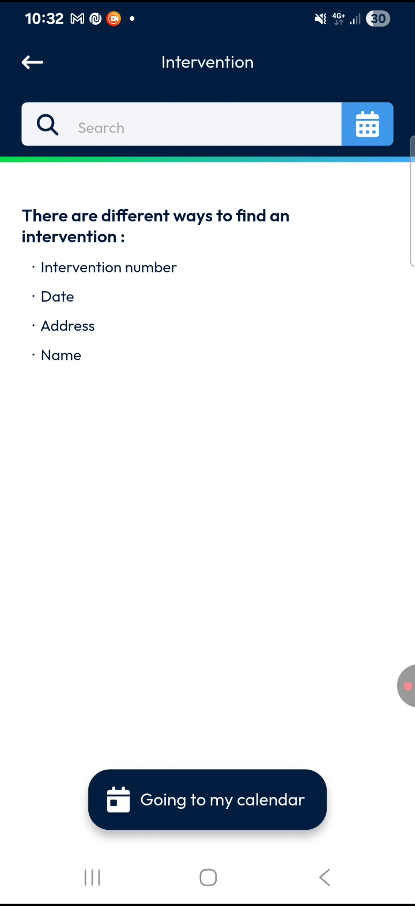
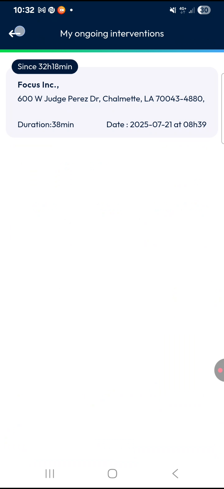
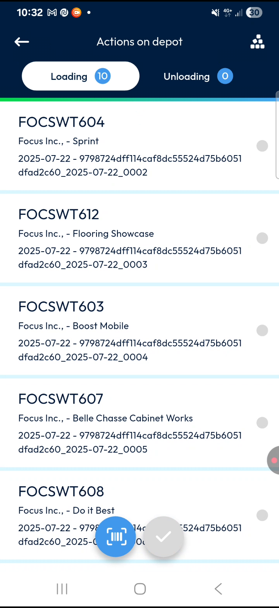
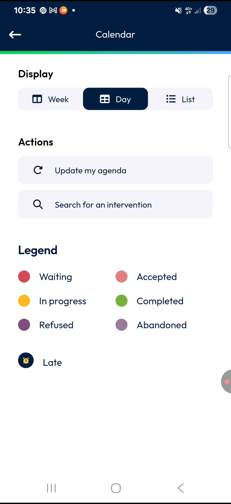
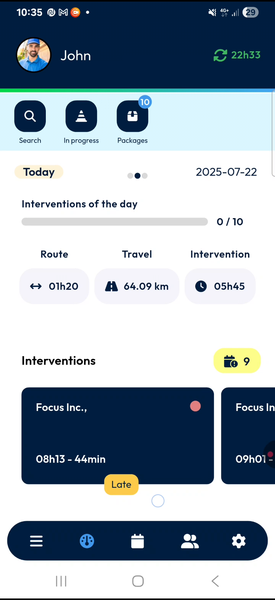
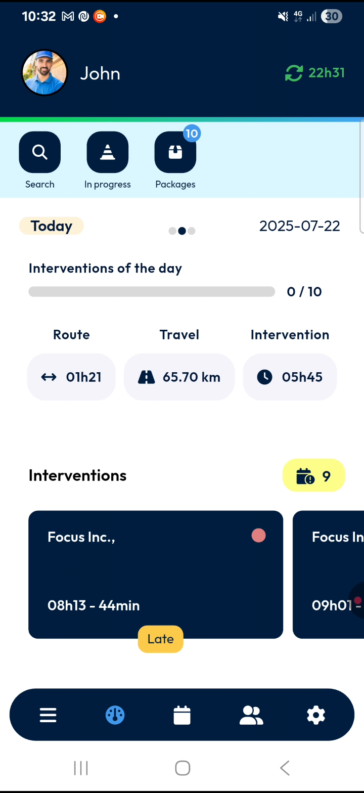
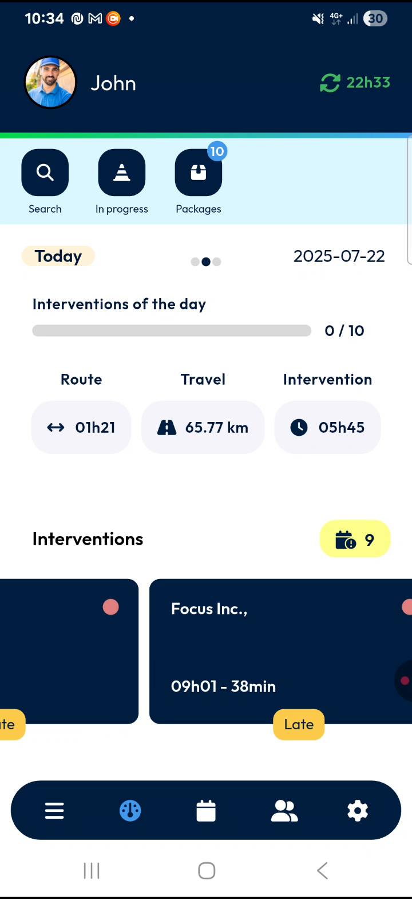

# MainActions-Dashboard

Welcome to your **TourSolver Mobile Dashboard**! After successfully logging in, the dashboard is your central hub for managing your daily tasks and keeping track of your progress efficiently and in real time. This guide will walk you through all the elements of your dashboard, helping you understand how each feature supports your workday.

### Getting Started

Upon successful login, you will immediately see your personalized **Dashboard** screen. This screen is designed to give you a quick overview of your day's activities.

*   **Initial View After Login**:
    When you first log in, your dashboard will display your schedule and progress. For instance, the **Progress bar** might show "0 by 10," which means you have 10 interventions scheduled for today, and none have been completed yet. This bar will update automatically as you complete tasks throughout the day.

*(Please note: As an AI, I cannot provide visual screenshots or diagrams.)*

### Feature Explanations with Benefits

The TourSolver Mobile Dashboard is packed with useful features designed to help you manage your day effectively.

*   **Top Section: Your Profile and Data Status**
    *   **Avatar and Name**: In the **top left corner**, you'll see your **profile photo (avatar)** and your **name** displayed next to it.
        *   **Benefit**: This confirms that you are logged in and helps personalize your experience.

    *   **Sync Time**: In the **top right corner**, you can see the **last time the app successfully synced with the back office**.
        *   **Benefit**: This tells you how up-to-date your data is, ensuring you're working with the latest information.

*   **Quick Action Buttons: Your Daily Tools**
    Just below the top section, these buttons provide quick access to important functions:
    *   **Search**: This button allows you to **quickly find any intervention** by entering a customer name, a number, a date, or an address.
        *   **Benefit**: Saves time by helping you locate specific tasks without having to scroll through your entire agenda.

    *   **In Progress Machines**: This button displays a **list of your interventions that are currently in progress**.
        *   **Benefit**: Helps you focus on tasks you are actively working on.
        *   💡 **Tip**: This button only appears if you have interventions currently marked as "in progress".

    *   **Load Packages**: This button is used to **load all the delivery packages onto your truck** before you start your route for the day.
        *   **Benefit**: Ensures you have all necessary items ready before beginning your daily tasks.

*   **Agenda Carousel: Your Schedule at a Glance**
    Below the quick action buttons, you'll find an **agenda carousel**.
    *   This shows your **schedule for today**.
    *   You can **swipe right** to view yesterday's agenda or **swipe left** to view tomorrow's agenda.
    *   The **day** (e.g., "today," "yesterday," or "tomorrow") is displayed on the **left side** of the carousel.
    *   The **actual date** for the selected day is shown on the **right side**.
    *   **Benefit**: Provides a clear, flexible view of your schedule for the current, past, or upcoming days.

*   **Progress Bar: Track Your Daily Completion**
    Below the agenda carousel, the **progress bar** visually represents **how many interventions you have completed today**.
    *   As you complete interventions, this bar automatically updates in real time.
    *   **Benefit**: Offers an immediate visual update on your progress, helping you stay motivated and on track.

*   **Route Summary: Your Workload Overview**
    Just below the progress bar, the **route summary** provides three key pieces of information for your day:
    *   **Route**: The **total distance** you will travel today.
    *   **Travel**: The **total planned kilometers** for the day.
    *   **Intervention**: The **overall duration of interventions** planned for the day.
    *   **Benefit**: Gives you a quick, essential overview of your daily workload, helping you understand the scope of your tasks.

*   **Intervention Section: Details of Your Tasks**
    Scrolling down, you'll enter the **intervention section** where all your day's tasks are displayed as **individual cards**.
    *   You can **swipe these cards from right to left** to browse through all your scheduled interventions.
    *   To the right of the "Intervention" label, you'll see a count of **how many interventions are late today**. For example, it might show "nine interventions are late today".
    *   Each **intervention card** displays important details:
        *   The **customer name**.
        *   The **scheduled time** for that intervention.
        *   The **estimated duration** of the intervention.
    *   **Colored Circle**: A small **colored circle** in the top right corner of each card represents the **current status of the intervention** (e.g., completed, accepted).
        *   **Benefit**: Provides a quick visual cue of the task's status.
        *   💡 **Tip**: You can find the **legend for these colors** in the **calendar menu** under the **filter option**.

.")

    *   **Late Flag**: If a task is late, you will see a small **yellow rectangle "late" flag** at the bottom center of the card.
        *   **Benefit**: Immediately highlights overdue tasks, helping you prioritize.

    *   **Benefit**: Offers a comprehensive and detailed view of each task, making it easy to see all necessary information at a glance.

*   **Main Navigation Buttons: Moving Around the App**
    At the very bottom of the dashboard, you'll find the **main menu buttons**. These allow you to easily switch between different screens in the app, including:
    *   **Menu**
    *   **Dashboard**
    *   **Calendar**
    *   **Leads and Customers**
    *   **Settings**
    *   **Benefit**: Provides seamless navigation throughout the TourSolver Mobile application.

### Common Tasks with Detailed Steps

Here’s how to interact with some key features on your dashboard:

*   **Reviewing Your Schedule for Different Days**:
    1.  Locate the **Agenda carousel** below the quick action buttons.
    2.  To see **yesterday's schedule**, **swipe the carousel to the right**.
    3.  To see **tomorrow's schedule**, **swipe the carousel to the left**.
    4.  The day and date displayed on the carousel will update to reflect your selection.

*   **Browsing Through Your Interventions**:
    1.  Scroll down to the **Intervention section**.
    2.  You will see your scheduled interventions displayed as individual cards.
    3.  To view all your interventions for the day, **swipe these cards from right to left**.

*   **Quickly Finding a Specific Intervention**:
    1.  Locate the **Search button** just below your profile information.
    2.  **Tap the Search button**.
    3.  **Enter the name, number, date, or address** of the intervention you're looking for.
    4.  The app will display matching results, helping you quickly jump to the desired task.

### Productivity Tips

*   💡 **Stay Synced**: Regularly check the **Sync time** in the top right corner. A recent sync means your data is up-to-date, which is crucial for managing your tasks effectively.
*   💡 **Plan Ahead or Review Past**: Use the **Agenda carousel** to quickly swipe between today, yesterday, and tomorrow. This helps you plan your upcoming day or review completed tasks.
*   💡 **Prioritize Late Tasks**: Always keep an eye on the **"late" count** in the intervention section and the **yellow "late" flag** on individual intervention cards. Addressing these promptly can help keep your schedule on track.
*   💡 **Understand Status at a Glance**: Familiarize yourself with the **colored circles** on the intervention cards and their meanings by checking the **legend in the Calendar menu under the filter option**. This allows for quick visual assessment of each task's status.
*   💡 **Leverage Quick Actions**: Make use of the **Search**, **In Progress Machines**, and **Load Packages** buttons. They are designed for quick access to essential functions and can significantly boost your efficiency.

The dashboard is your ultimate tool for managing your daily tasks with confidence and efficiency. If you need more detailed information on any specific section, please refer to other dedicated guides.